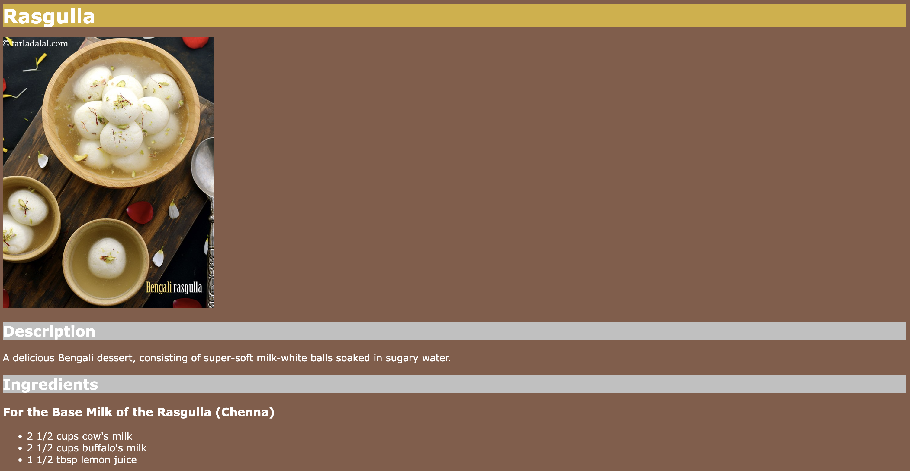

# Indian Recipes

This is the first project I created as part of [The Odin Project's](https://www.theodinproject.com/) full stack curriculum.

The project is a simple website that consists of the recipes of three Indian dishes – Aloo Paratha, Chole Bhature, and Rasgulla. All the recipes have been sourced from [Tarla Dalal's website](https://m.tarladalal.com/). 

I created the website as a quick and fun review of elementary HTML skills.

I updated the website with basic CSS styling when I reached later modules ([1](https://www.theodinproject.com/lessons/foundations-the-cascade) and [2](https://www.theodinproject.com/lessons/foundations-block-and-inline)) of the [Foundations Course](https://www.theodinproject.com/paths/foundations/courses/foundations).

## [Live Preview](https://maahirjain.github.io/indian-recipes)
Visit at [maahirjain.github.io/indian-recipes](https://maahirjain.github.io/indian-recipes).

  
  
 
